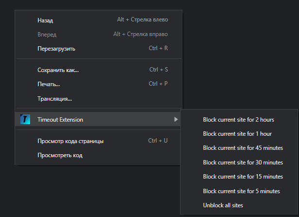
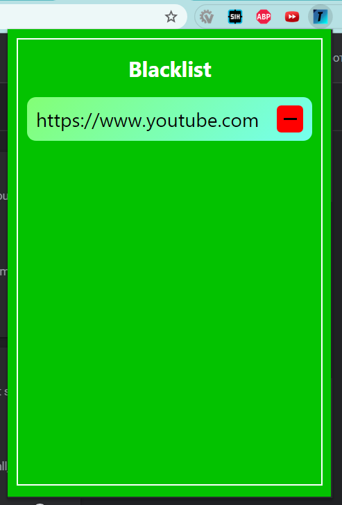

# Timeout Extension

This extension is for chromium browsers

## Base usage:

When you click right mouse button on every site, you open window like this:

If you press "Block current site for X minutes", current site's origin will be added to blacklist for X minutes
If you enter this site during next X minutes, tab with it will be closed

If you want to empty all blacklist, press "Unblock all sites"

## If you press extenstion icon in the top right corner, it will open your blacklist

Red bitton - remove site from blacklist
